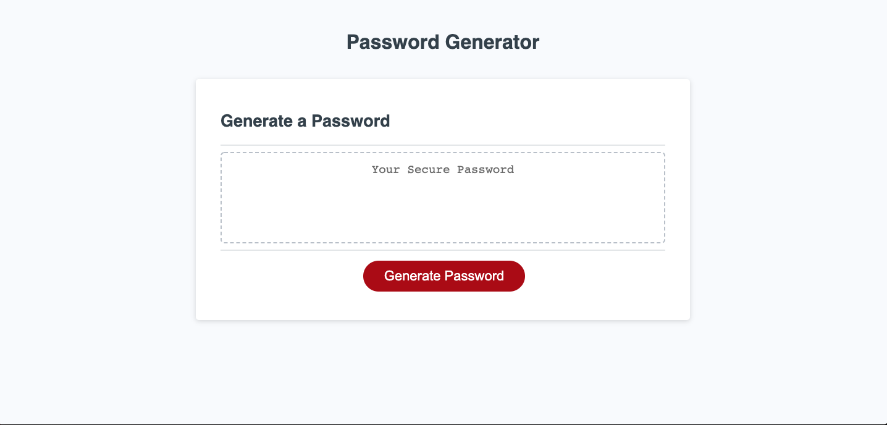
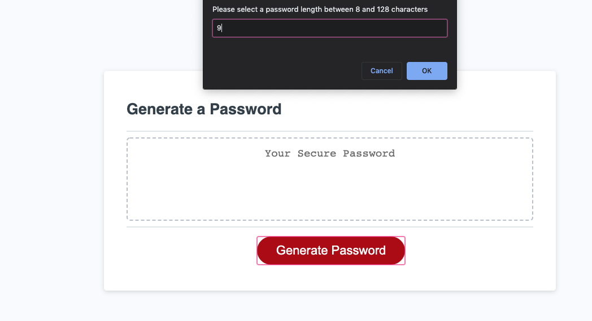
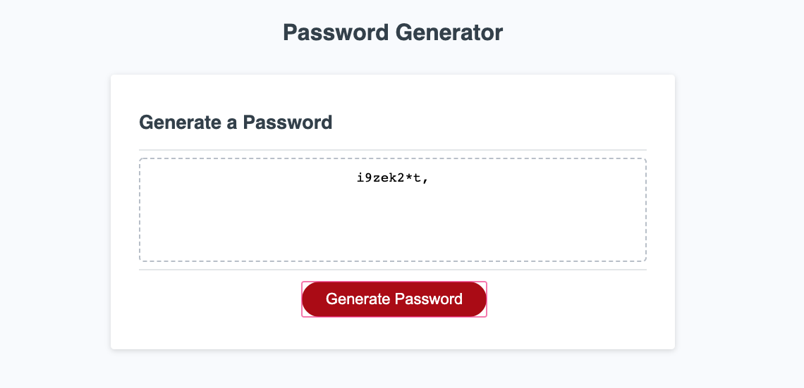

# Password Generator

## Description

This application generates a random password based on user-selected criteria.

## For Further Development

Currently the application can generate a password within a specified length with the characters chosen by the user. However, it does not yet validate that all character types chosen are present in the final password. Also, it does not currently re-set to allow user to intuitively re-run the application on-click of the generate password button. These are issues I hope to resolve in the future.

## Lanuages Used

Javascript, CSS, HTML

## Screenshots of application

Upon pressing Generate Password button, the user is presented with a prompt to select password length.  

After selecting password length, the user is presented with a series of confirms to select password characters.

Once criteria are chosen, the application prints the newly generated password to the screen.

## Link to application

[Password Generator](https://jnel-221.github.io/youShallPassWord/)
